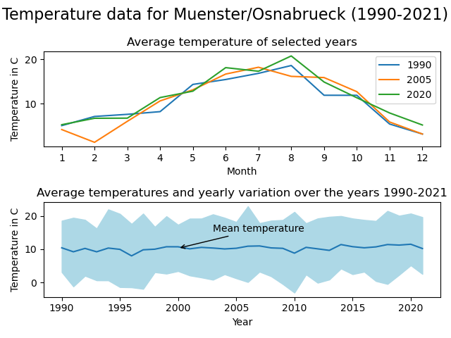
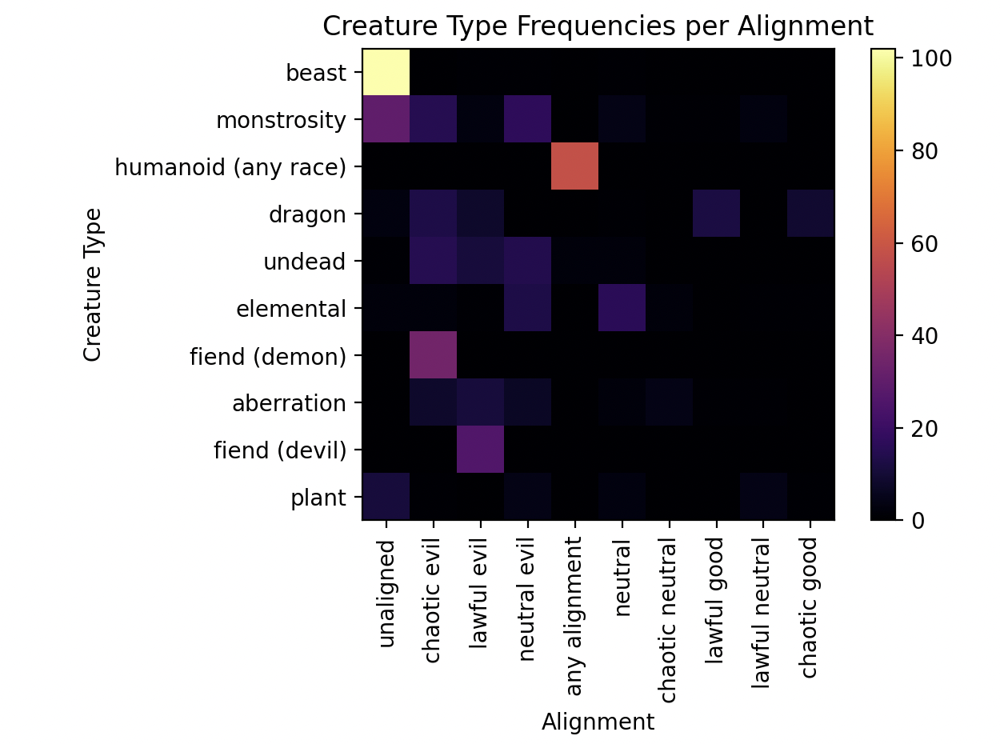
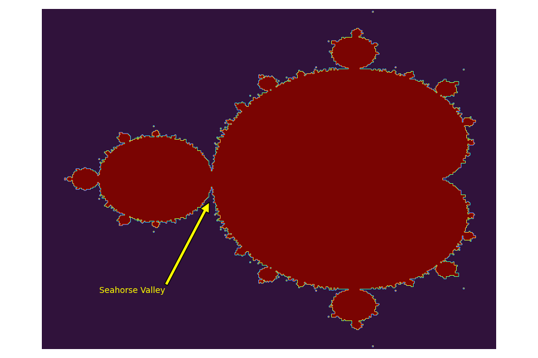

# Homework 5 - Matplotlib

The deadline of this homework is on **Tuesday, 23rd of May, 23:59:00 UTC+2**.

This week's homework is all about visualizing data. The resulting plots will not only look pretty, but also demonstrate how figures for scientific publications can be created.

Before you start, make sure your conda environment is activated and that you have all the necessary packages installed (`numpy`, `matplotlib`, `pytest`, `pandas`).

**Important:** To pass this week you will only have to implement task 1 and 2. Task 3 is a bonus task that you can take a look at if you want some more practice, but it is not required to pass this week's homework. We have included `pytest` files for all 3 tasks, but the Classroom Autograding will only check for completion of task 1 & 2. 

Please note that since we have included a test file for the bonus task, just running `pytest` will always check all 3, so if you have solved task 1 & 2 but not 3, `pytest` will tell you that you have only passed 2/3. You can ignore this since you only need to pass the first two tasks, and the classroom autograding will only check those. To check task 1 & 2 seperately you can execute `pytest test_temperature.py` and `pytest test_heatmap`.

## A Word about Autograding for Visualizations

Autograding for visualizations is notoriously tricky, because **the produced image can have slight variations** depending on what operating system (Linux|Windows|MacOS) and what hardware (screen resolution, graphic card, etc.) the code is being run on. In the past, this homework was graded by comparing the pixels of the produced images to expected images, but even with a lenient tolerance setting this system led to a lot of frustration.

Because of this, we do something different: We are still providing you with expected images, but **do not compare your output to these images**. Instead we use `pytest` to **check if your code has changed the appropriate attributes** in the `matplotlib` objects that your functions return. For you, that means no changes to the workflow of the previous homeworks.

Hopefully, the changes will make this homework more enjoyable. Still, if you think that your code generates exact/correct outputs but pytest is not working correctly, please contact the tutors.

## This Homework

There are 2 mandatory task and 1 bonus task in this homework:

- Plotting Temperature Data: `temperature.py`
- Making a Custom Heatmap: `heatmap.py`
- Visalizing the Mandelbrot Set (Bonus): `mandelbrot.py`

In all tasks, you are asked to write a function that returns a `Figure` object of shape `(9, 6)` as well as one or more `Axes` objects. You can use all packages that were introduced so far (`numpy`, `matplotlib`).

**Useful resources:**

- Documentation of `plt`: [matplotlib.pyplot](https://matplotlib.org/stable/api/pyplot_summary.html)
- Documentation of `Axes`: [matplotlib.axes](https://matplotlib.org/stable/api/axes_api.html)
- Documentation of `Figure`: [matplotlib.figure](https://matplotlib.org/stable/api/figure_api.html)

## Task 1 - Plotting temperature data

In this task, you have to implement the function `plot_temperature`, which takes a NumPy array `data` (shape is `(32, 12)`). It contains the monthly average temperature of the years 1990-2021 measured at the DWD weather station Münster/Osnabrück. The array contains 32 entries for the years 1990-2021 in ascending order, each year consisting of 12 entries containing the average temperature of each month in order starting with January. The full data can be found [here](https://www.dwd.de/DE/leistungen/klimadatendeutschland/klarchivtagmonat.html) (select Münster/Osnabrück, Monatswerte, historisch).

You will have to create two subplots (2 rows, 1 column). The first subplot should contain three line plots each depicting the monthly temperatures of a year (1990, 2005 and 2020) with the months on the `x-axis` and the temperature on the `y-axis`. Label these three line graphs with "1990", "2005" and "2020" respectively and display the legend for the first subplot. 

Set the first subplot's title to "Average temperature of selected years", `x-axis` label to "Month" and its `y-axis` label to "Temperature in C".

The second subplot should display the average temperatues and yearly variation over all the years. Calculate the minimum, maximum and mean temperature of all years. Then plot the mean temperature as a simple line plot and also fill the area between the minimum and maximum temperature over all years in a color that is differentiable from the color of the line. Also add an annotation for the mean line containing the text "Mean temperature" in a style and location that you find sensible.

Set the second subplot's `x-label` to "Year", the `y-label` to "Temperature in C" and the title to "Average temperatures and yearly variation over the years 1990-2021".

Tips for the second subplot:
- Using NumPy could be helpful here.
- All you should need to customize the annotation can be found [here](https://matplotlib.org/stable/tutorials/text/annotations.html).

Finally, set the figure's super-title to "Temperature data for Muenster/Osnabrueck (1990-2021)" with a font-size of 16.

The function should return a figure and 2 axes.

Example:

## Task 2 - Making a Custom Heatmap

In this task, we will work with the `Dungeons & Dragons` dataset, which is already processed and imported as `freq_values`, `freq_names_type`, and `freq_names_align` in `heatmap.py`. You can find it in [data/dnd_monsters.csv](data/dnd_monsters.csv).

Your task is to write a function `make_heatmap` that creates a heatmap of the frequencies of creature types and their alignments. Although high-level packages such as [seaborn](https://seaborn.pydata.org/) have specialized functions for this task, we will do it using pure matplotlib. The resulting plot should look like this:

Here are some steps that can be followed to solve this task:

1. Create the necessary `Figure` and `Axes` objects.
2. Plot the quadratic data with pairwise combination counts using `imshow` with the colormap `inferno`.
3. Set the necessary labels and title for the `Axes` object.
4. Create a colorbar on the right side of the plot.
5. Set the labels with creature types and their alignments.
6. Return the `Figure` and `Axes` objects.

## **Bonus**: Task 3 - Visualizing the Mandelbrot Set

In this task, we will visualize the famous [Mandelbrot Set](https://en.wikipedia.org/wiki/Mandelbrot_set). For this, you are given a function `mandelbrot` that returns a boolean array representing a rectangular view of the Mandelbrot Set. The resulting plot should look like this:

The `mandelbrot` function accepts positional and keyword arguments. You can leave the keyword arguments at their default value and use `x`, `y`, `dx`, `dy` to specify which part of the Mandelbrot Set will be visualized. `x` and `y` determine the upper left corner, `dx` and `dy` the offset from that point along the respective axis. We are interested in the main corpus, which lies between the locations `(-1.5, 1.0`) and `(0.5, -1.0)`.

Here are some steps that can be followed to solve this task:

1. Create the necessary `Figure` and `Axes` objects.
2. Create the Mandelbrot boolean array using `mandelbrot`.
3. Plot the Mandelbrot data with the colormap `turbo`.
4. Create an `annotation` that points out the beautiful [Seahorse Valley](http://www.alunw.freeuk.com/seahorsevalley.html) at `(147, 170)`.
5. Turn off the unneeded axis of the plot.
6. Return the `Figure` object and one `Axes` object.

**Bonus:** Play around with the keyword parameters of `mandelbrot`. At which setting is the Seahorse Valley the most beautiful?
