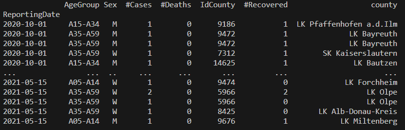
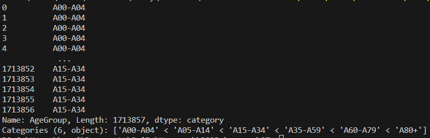
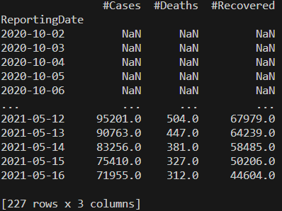

# Homework 7 - Advanced Pandas

The deadline of this homework is on **Tuesday, 13th of June, 23:59:00 UTC+2**.

This week is about the Pandas library again, with a focus on loading and preparing data. All tasks are mandatory this week.

## The data

This week, we will have a look at the Covid-19 dataset from the German Robert Koch Institut (RKI).
Unfortunately, the Covid dataset is in german. Therefore, we translated the column names to English.
In order to reduce the amount of data, we provide only a subset of the columns and only the cases from **October 1. 2020** to **May 15. 2021**.
Additionally, we will also use the counties dataset from the RKI.

Before you try to solve the tasks, make sure to take a look at the data, either with pandas or your favourite spreadsheet application and understand what both datasets represent.

## Allowed Imports

For this homework you can use the **numpy**, **pandas** and **matplotlib** library.
You do not need matplotlib but you can use it to get an overview over the data if you like.
Further you can use

    from pandas.api.types import CategoricalDtype

and import your own load_data module for use in other files.

    from load_data import load_data

## Task 1 - Loading the data

Implement the function `load_data()`, which performs the following steps.

Load the `RKI_COVID19.csv` file and the `RKI_Counties.csv` file.
Make sure to correctly parse the `ReportingDate` column as dates for the first dataset.

Then, perform a left outer join of the two DataFrames. The `RKI_COVID19` table should be considered as the left table.
Join the two DataFrames on the `IdCounty` column. The county ID in the `RKI_Counties` DataFrame is called `RS`,
you might want to rename this column before merging.
The resulting DataFrame should include all columns from the `RKI_COVID19`
DataFrame plus the `county` column from `RKI_Counties`.

Finally, set the index of the merged DataFrame to the `ReportingDate` column, sort the index and remove the `AgeGroup2` column since it does not contain sensible data. Also drop any unnamed columns, which can be the result of loading the csv file without specifying index-columns.

Return the final DataFrame, which should look like this.

## Task 2 - Creating categorical data

Implement the `to_categorical` function, which receives a Series object with the values from the `AgeGroup` column
from task one. Change the type of this series to an ordered categorical type. Make sure that the categories preserve the order of age groups! Also, replace all `unbekannt` (unknown) values with `np.nan`, such that they don't appear in the Series' categories.
You should return the categorical series object in the end.

**Hint:** Have a look at `CategoricalDtype`.

## Task 3 - Looking at weekly time windows

For this task, you need to have already solved Task 1 so that the data can be loaded properly.

A common measurement used by the media to access the situation of the corona crisis is the number of cases in a seven-day window.
In this task you will compute this measurement for the number of cases, number of deaths and number of recoveries.

Implement the function `seven_day_window`, which takes the dataframe returned by task 1 and computes the sum of the seven previous
days for the `#Cases`, `#Deaths` and `#Recovered` columns.

First, you will need to take only the relevant columns and then resample your data to sum over all the values submitted in a day.
Next use a window function to get the sums in a seven-day window. The first six values of the result should be nan as not enough values are available to compute a seven-day window.

Lastly shift the dateindex by one day, as the value of a given day is composed of the sum of the **previous** seven days.
For example, the value you computed for October 7. should be shifted to October 8.

Return the resulting dataframe. It should have a datetime-index with 227 rows and three columns.

**Hint:** Have a look at the `resample`, `rolling` and `shift` functions.

> Good luck!

**P.S.:** Feel free to play around with the data to get more familiar with the dataset and Pandas.
