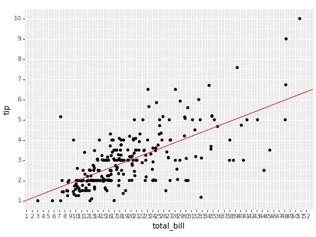

# Homework 08

The deadline of this homework is on **Tuesday, 20th of June, 23:59:00 UTC+2**.

This week's homework is about visualizing data again, this time with seaborn and a little bit of modeling using statsmodels and ggplot. Both tasks are mandatory. 

For the second part you will need the python modules statsmodels and plotnine, which you can install into your active environment like this if you haven't already.

    conda install -c conda-forge statsmodels plotnine

## A Word about Autograding for Visualizations

Autograding for visualizations is notoriously tricky, because **the produced image can have slight variations** depending on what operating system (Linux|Windows|MacOS) and what hardware (screen resolution, graphic card, etc.) the code is being run on. In the past, this homework was graded by comparing the pixels of the produced images to expected images, but even with a lenient tolerance setting this system led to a lot of frustration.

Because of this, we do something different: We are still providing you with expected images, but **do not compare your output to these images**. Instead we use `pytest` to **check if your code has changed the appropriate attributes** in the `matplotlib/ggplot` objects that your functions return. For you, that means no changes to the workflow of the previous homeworks.

Hopefully, the changes will make this homework more enjoyable. Still, if you think that your code generates exact/correct outputs but pytest is not working correctly, please contact the tutors.
## **Task 1 - Density**

In this task you will use `seaborn`.
Write a function `make_densityplot(iris)`
that displays the joint density of `sepalWidth` and `petalWidth` for each species, plus the marginal
density of the two variables on the side of the plot. The marginals densities should be shaded.
There is a `seaborn` **figure level** function that does this for you with very little configuration.
It is important that you use the figure level function. Otherwise the autograding will fail.
Consult the function's documentation to find out how to achieve the exact
customizations. 

There are at least two different ways to achieve the desired shading in the outer plots. The easier one will apply shading to the inner plot as well, but there is also a method to apply shading to the outer plots like in our example. For this task both methods are fine.

## **Task 2 - Linear regression**

For this task we want you to take a look at a dataset of restaurant tips included in `seaborn`. We want to know if and how the amount of `tip` is influenced by the amount of the `total_bill`. To that end you should write a `simple_regression()` function using the `statsmodel` `smf.ols` feature as demonstrated in the lecture, in order to fit a linear regression model on the two variables of the given data. The function should receive the full dataset and `return` the fit `RegressionResult` object.

Additionally you should write a `plot_regression()` function that receives the dataset and your fit object and returns the regression line `plotnine.ggplot` object. In your main you can print it out for testing.

For this task you should be able to copy the example ggplot from the "Doing Statistics with Python" lecture notebook without too many variations. Make sure to use the correct values for the slope and intercept, which should both be accessible from the `fit` object that the function receives.

After taking a look at both the results of the first function with `fit.summary()` and the plot from the second function add your interpretation of the results to the bottom of the `regression.py` file.

> Good luck!
