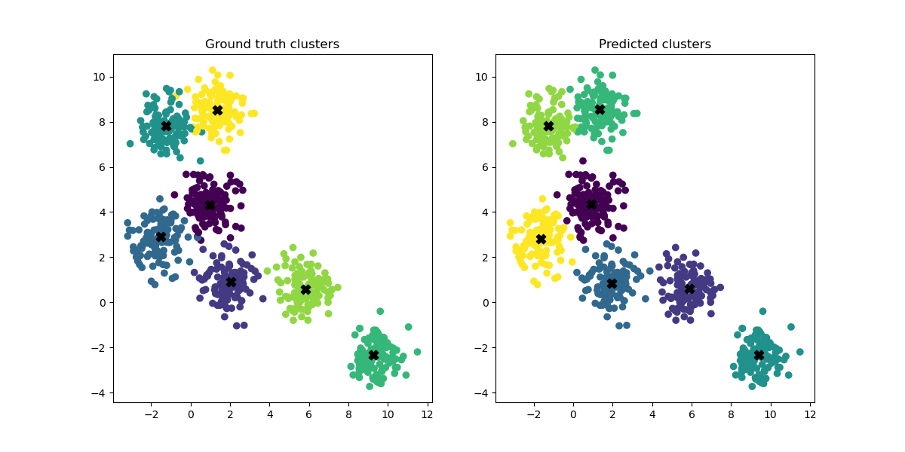

# Homework 09

The deadline of this homework is on **Friday, 30th of June, 13:59:00 UTC+2**.

This week's homework is about a number of machine learning techniques using scikit-learn. For the second task you are also allowed to use matplotib and numpy. Both tasks are mandatory. We also try something different this week. Since the coding part of the tasks should be quite easy, we also include a few questions that you should answer. 

You don't have to write much, bullet points or short sentences are enough here. We simply want to be able to see that you understood how the code works and have put some effort into understanding/optimizing it. Obviously we can't check your answers with pytest but we will be able to take a look manually and **will fail you if you have made no effort to answer them, even if your pytests pass**.

For this homework you will need scikit-learn, which you can install into your active environment like this if you haven't already.

    conda install -c conda-forge scikit-learn

## **Task 1 - Classification**

In this task you will use the [KNeighborsClassifier](https://scikit-learn.org/stable/modules/generated/sklearn.neighbors.KNeighborsClassifier.html) to classify [handwritten digit images](https://scikit-learn.org/stable/modules/generated/sklearn.datasets.load_digits.html).

Write a function `classify(data)`. It should receive the handwritten digit data and split it into a sensible train/test split using [`train_test_split`](https://scikit-learn.org/stable/modules/generated/sklearn.model_selection.train_test_split.html) with a train size of 0.3. Next create a `KNeighborsClassifier` classifier, fit it to the data and then return it. To test if and how well it works you should use the test data and the classifiers `.score()` method either before returning or in your main. You should be able to achieve at least an accuracy of 95%.

Now that your classifier works we want you to play around with all the parameters you can think of in order to achieve the best accuracy score possible. In order to get comparable results you should set the `random_state` parameter of the `train_test_split` to `0`, since by default it shuffles the data (which is usually a good thing, but not in this case). Take a look at all the parameters of the classifier object and change them around, testing different values and combinations. You can do that by hand or write a function that does it for you.

Now it's time to analyze your results. Below in this README file, answer the following questions:
1. What was the highest accuracy you managed to achieve and with which parameters? 
2. Which parameters influenced the result and which didn't?
3. Do you have an idea how to explain the results of the first 2 questions? (If you have no idea what to write here you can leave it out)

### Your answers go here:

1.  Best k: 3  
    Best weights: distance  
    Best algorithm: ball_tree  

2. The algorithm parameter did not influence the result. The weights parameter and the k parameter did influence the result.

3. The strucutre of the data is favors a small k and the distance weights

## **Task 2 - Clustering**

In this task you will use [KMeans](https://scikit-learn.org/stable/modules/generated/sklearn.cluster.KMeans.html#sklearn.cluster.KMeans) to cluster data that you will create yourself.

First write a function `generate_data`. It should receive the number of samples, number of centers and standard deviation of the clusters. Use [`make_blobs`](https://scikit-learn.org/stable/modules/generated/sklearn.datasets.make_blobs.html#sklearn.datasets.make_blobs) to generate the data and return the generated samples as well as the labels and the centers. Set the random state of the generator to `0` in order to have comparable results later.

Next write a function `cluster`. It should receive the generated data, true labels and centers and the number of clusters to be detected. In it create a `KMeans` object, fit it to the data and extract the computed labels and centroids. Then return the kmeans object, the labels and the centroids.

To assess the result you should now (visually and/or numerically) compare the predicted labels and centroids with the ground truth centroids and labels. You could write a third function for this, but you could also do it in `__main__`. We will not check this with pytests so you can use whatever method you would like, but a visualization using matplotlib could look like this: 

Now that your KMeans algorithm works we again want you to play around with the initial parameters that we have set to sensible default values in `__main__` and examine the results. You can do that by hand or write a function that does it for you.

Now answer the following questions:

1. Was there anything interesting/noteworthy you found when playing around with the initial parameters? (for example: what if the number of centers and number of clusters are not the same?)

Take a look at this page: [k-means assumptions](https://scikit-learn.org/stable/auto_examples/cluster/plot_kmeans_assumptions.html).

2. What are the four limitations of the k-means algorithm highlighted here and why does k-means have problem with each of them?
3. What are possible solutions to each of the problems?

### Your answers go here:

1. When the number of centers and the number of clusters are not the same, the resulting clusters may not correspond to the centers of the true clusters.

2.
    1. Non-optimal number of clusters: The algorithm does not know the optimal number of clusters. It is up to the user to find the optimal number of clusters.
    2. Anisotropically distributed blobs: k-means assumes that the clusters are spherical. If the clusters are not spherical (e.g. anisotropically distributed blobs), the algorithm will not perform well.
    3. Unequal variance: As k-means assumes that the clusters assumes that the clusters have equal variance, it will not perform well if the clusters have unequal variance.
    4. Unevenly sized blobs: k-means assigns data points to the nearest centroid based on Euclidean distance. If the clusters are unevenly sized, the algorithm will not perform well.

3. 
    1. The user can use silhouette analysis to find the optimal number of clusters. The silhouette score is a measure of how similar an object is to its own cluster compared to other clusters. The optimal number of clusters is the number of clusters that maximizes the silhouette score.
    2. The user can use the Gaussian mixture model algorithm instead of k-means.
    3. The user can use the Gaussian mixture model algorithm instead of k-means.
    4. The user can increase the number of random initializations of the centroids.
